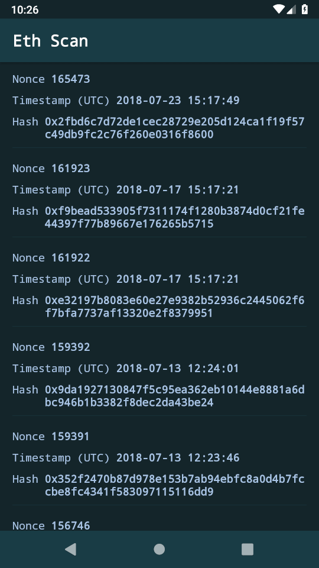

# EthScan

An app for exploring the transactions of an Ethereum address.

**Components and libraries used:**
- [x] Navigation Architecture Component
- [x] ConstraintLayout
- [x] RxJava
- [x] Retrofit
- [x] JVM Unit tests
- [x] Espresso tests
- [x] SwipeRefreshLayout

things to refactor...
- [ ] memory leak from RxJava
    * [ ] UI test: rotate the phone while a request is in progress
    * [ ] the app crashes if rotated while loading
- [ ] make a separate file for 'e2e' tests, using a real endpoint
- [ ] model decoupled from Activity lifecycle
- [ ] use Retrofit Rx plugin
    * add to readme
- [ ] don't re-initialise Retrofit regularly
- [ ] MVP pattern
- [ ] use DI in Tests - mock the datasource
- [ ] more JVM tests
- [ ] do not be wasteful when setting up recyclerview

### in progress
- [ ] dependency injection
   * data source
   * presenter
- when this is set up, we can UI test the crash when rotating while loading!
